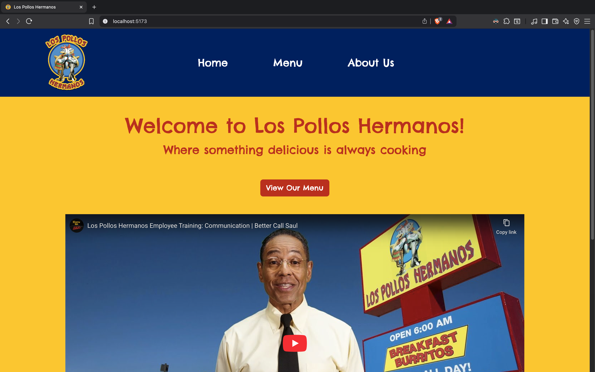
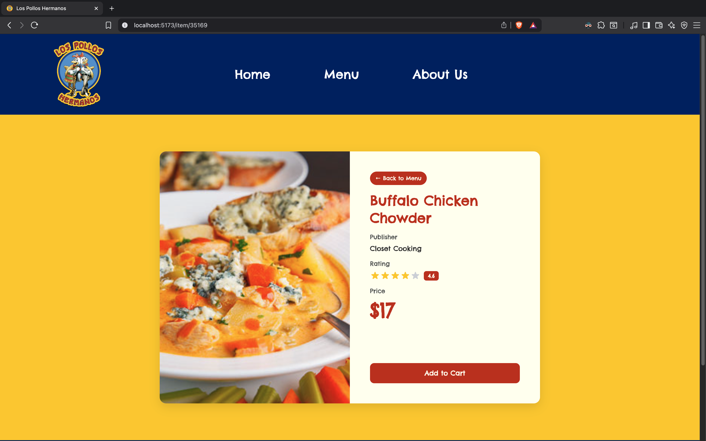

# Los Pollos Hermanos

Los Pollos Hermanos is a modern restaurant web application built with React. It features a responsive menu, detailed item pages, and a stylish UI inspired by the iconic restaurant from Breaking Bad and Better Call Saul. The app demonstrates best practices in React development, including component structure, routing, and API integration.

## Features
- **Responsive Design**: Fully responsive layout for mobile, tablet, and desktop
- **Dynamic Menu**: Browse a curated menu of chicken recipes with images, prices, and ratings
- **Item Details**: View detailed information about each menu item
- **Modern UI**: Clean, themed interface using Bootstrap and custom styles
- **Loading States**: Smooth loading indicators for data fetching

## Technologies Used

### Frontend
- **React 19**: Latest version of the popular JavaScript library for building user interfaces
- **React Router 7**: For navigation and routing within the application
- **Bootstrap 5**: For responsive design and pre-styled components
- **MDB React UI Kit**: For additional UI components and icons
- **Axios**: For making HTTP requests to the API

### Development Tools
- **Vite**: Next generation frontend tooling for fast development and optimized builds
- **ESLint**: For code linting and maintaining code quality
- **npm**: Package manager for JavaScript

### API
- **Forkify API**: RESTful API providing chicken recipe data for the menu

## Getting Started

### Prerequisites
- Node.js (v16 or higher)
- npm (v7 or higher)

### Installation

1. Clone the repository
```bash
git clone https://github.com/omarovici/los-pollos-hermanos.git
cd los-pollos-hermanos
```

2. Install dependencies
```bash
npm install
```

3. Start the development server
```bash
npm run dev
```

4. Open your browser and navigate to `http://localhost:5173`

### Building for Production

```bash
npm run build
```

The build artifacts will be stored in the `dist/` directory.

## Project Structure
├── public/              # Public assets  
├── src/                 # Source files  
│   ├── assets/          # Static assets  
│   ├── components/      # Reusable components (Menu, Item, Navbar, Footer, etc.)  
│   ├── App.jsx          # Main application component  
│   ├── App.css          # Application styles  
│   ├── index.css        # Global styles  
│   └── main.jsx         # Entry point  
├── .gitignore           # Git ignore file  
├── eslint.config.js     # ESLint configuration  
├── index.html           # HTML template  
├── package.json         # Project dependencies and scripts  
├── README.md            # Project documentation  
└── vite.config.js       # Vite configuration

## Components

The `src/components` directory contains reusable UI components that make up the application:

- **NavBar**: Responsive navigation bar for site-wide navigation.
- **Footer**: Themed footer with social links and acknowledgements.
- **Home**: Landing page with welcome message and video.
- **AboutUs**: Page with information and themed video about the restaurant.
- **Menu**: Displays the dynamic menu of chicken recipes fetched from the API.
- **Item**: Detailed view for each menu item, including image, price, rating, and publisher.
- **Loader**: Loading spinner shown while data is being fetched.
- **NotFound**: 404 page for unmatched routes.

Each component is organized in its own folder with related styles and logic for maintainability.
## Screenshots

### Home Page


### Menu Page


### About Us Page


### Item Page


<!-- Place your screenshots in ./assets/screenshots/ and update paths if needed -->

## License
MIT

## Acknowledgements
- [Forkify API](https://forkify-api.herokuapp.com/) for providing the recipe data
- [React](https://reactjs.org/) for the amazing library
- [Vite](https://vitejs.dev/) for the blazing fast build tool
- [Bootstrap](https://getbootstrap.com/) for the responsive design framework
- [MDB React UI Kit](https://mdbootstrap.com/docs/react/) for UI components
